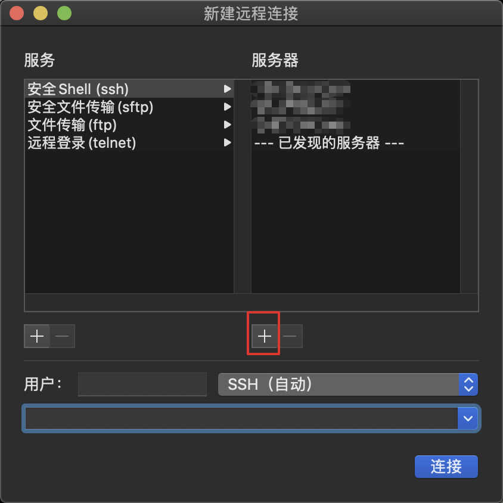

# 服务器远程连接

## mac终端连接

mac可以使用终端直接进行远程服务器连接

输入远程服务器的IP

这样就可以在本地直接进行远程连接操作服务器了

## Xshell连接

以下内容转载自：[https://www.xshellcn.com/xsh\_column/lianjie-linux.html](https://www.xshellcn.com/xsh_column/lianjie-linux.html)

### 具体步骤如下：

一、打开Xshell软件。双击桌面上的Xshell软件快捷图标，就可以打开软件，打开的软件主界面如下图所示。

二、执行新建命令。打开Xshell软件后找到左上角第一个“文件”菜单并单击，弹出来一个下拉框，点击选择“新建”命令（或者直接按下快捷键“Alt+n”）。

三、点击“新建”之后就会出现下面这样一个界面，“名称”根据自己的需求填写，“协议”就是默认的SSH，“主机”是这一步最关键的，一定要填写正确，否则无法登录，端口也是默认的22，其他不用填，填写完成之后先不要点确定，看下一步。

四、找到连接选项栏中的“用户身份验证”点击，点击之后会让你填写用户名和密码，其中“方法”默认“password”，“用户名”填写你的FTP用户名，“密码”填写你的FTP密码，填写完成点击确定。

五、登录刚才保存的账号，单击左上角的“文件”菜单，在其下拉选项选择“打开”命令，弹出会话对话框，左下角有一个选项“启动时显示此对话框”，这个选项的意思是：每次打开Xshell都直接跳出这个对话框，根据需求勾选，然后找到你想登录的服务器，点击“连接”即可。

连接之后出现如下界面中的\[root@**\*\***\]样式的，就证明连接成功了。

